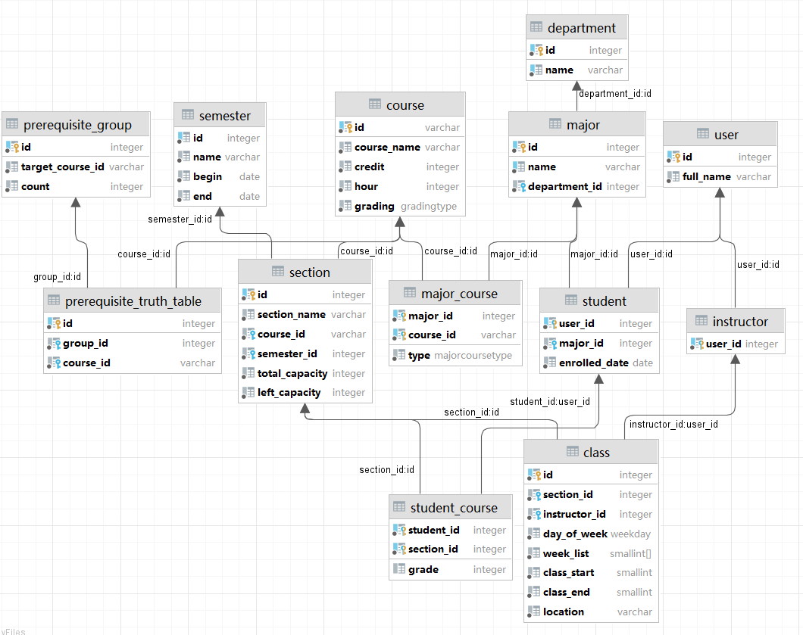

# CS307 Database Project 2 Report

## Group Member:

12011525 徐延楷

12011528 张艺严

12012524 陈张杰

## Database Design

### Structure:

We designed our database as the following structure:



### Prerequisites

The prerequisite part is implemented with a truth table and a table to store the group(lines) in truth table.

The truth table is represented as `List<List<String>>` in java, and table(id, group_id, course_id) in db.

In db, the row of truth table will only contain column with value 1. So, the truth table a little special. It is
consisted of several groups, every group contains a linear independent combination of "columns" to make the output true.

So, comparing to traditional truth table, it save a lot of space, and it's easy to query in sql.

Code:

```java
List<List<String>> truthTable = prerequisite.when(new Prerequisite.Cases<>() {
        @Override
        public List<List<String>> match(AndPrerequisite self) {
            List<List<String>> res = self.terms.get(0).when(this);
            for (int i = 1; i < self.terms.size(); i++) {
                Prerequisite term = self.terms.get(i);
                List<List<String>> tmp = new ArrayList<>();
                for (List<String> resList : res) {
                    for (List<String> itemList : term.when(this)) {
                        List<String> productRes = new ArrayList<>();
                        productRes.addAll(resList);
                        productRes.addAll(itemList);
                        tmp.add(productRes);
                    }
                }
                res = tmp;
            }
            return res;
        }

        @Override
        public List<List<String>> match(OrPrerequisite self) {
            ArrayList<List<String>> res = new ArrayList<>();
            for (Prerequisite pre : self.terms) {
                res.addAll(pre.when(this));
            }
            return res;
        }

        @Override
        public List<List<String>> match(CoursePrerequisite self) {
            ArrayList<List<String>> res = new ArrayList<>();
            res.add(new ArrayList<>());
            res.get(0).add(self.courseID);
            return res;
        }
    });
    stmt =conn.prepareStatement("INSERT INTO public.prerequisite_group (id, target_course_id, \"count\") VALUES (DEFAULT, '"+courseId +"', ?)");
    PreparedStatement truthTableStmt = conn.prepareStatement("INSERT INTO public.prerequisite_truth_table (id, group_id, course_id) VALUES (DEFAULT, ?, ?)");
    for (List<String> group :truthTable) {
        stmt.setInt(1, group.size());
        stmt.addBatch();
        for (String preCourseId : group) {
            truthTableStmt.setInt(1, groupSerialStart);
            truthTableStmt.setString(2, preCourseId);
            truthTableStmt.addBatch();
        }
        groupSerialStart++;
    }
        stmt.executeBatch();
        truthTableStmt.executeBatch();
}
```

#### Import

To convert boolean tree to truth table, we used methods below:

For leaf node: create list of one group contains the node itself.

For or node: merge its child groups' lists.

For and node: use its child groups' lists to do cartesian product and get result.

After get the table, store every groups' id and size to table prerequisite_group, and store every group to
prerequisite_truth_table with its group number.

#### Query

To check if a course satisfy its prerequisite is simple.

The main idea is join the truth table and table student_course, and count the remaining rows of each group. If one group
has all its rows after join, prerequisite is satisfied.

### Import Data

Most import is implement by simple insert statement. If the import has some additional requirement, such as import user
need to insert into two tables, functions are used to meet requirements.

Imports with large quantity and no need to return(value or throw exception) is special treated. They are packed into
`BatchedStatement`. Instead of import every row one by one, these rows would be packed and insert together with addBatch.

To do this, another thread is introduced. It serves as a timer. If a row is submitted into BatchedStatement, the counter
would reset to 50ms. And if there are 114514 rows waiting to be submitted or the timer has run off, a batch will be
added to sql.

BatchedStatement is thread-safe, though it was implemented is a very inelegant way. Nearly all methods of 
BatchedStatement has lock, makes them run in order. And if a method in this project use the table imported by 
BatchedStatement, it needs to call the join() method manually to prove the consistency of data.

Although the lock in BatchedStatement costs much, it is still significantly faster.

Code:

```java
public BatchedStatement(String sql, String name) throws SQLException {
    this.sql = sql;
    start = System.nanoTime();
    countdown.set(COUNTDOWN_TIME);
    conn = SQLDataSource.getInstance().getSQLConnection();
    conn.setAutoCommit(false);
    stmt = conn.prepareStatement(sql);
    thread = new Thread(() -> {
        while (true) {
            try {
                if (!submitting.get()) countdown.decrementAndGet();
                if (countdown.get() <= 0) break;
                Thread.sleep(1);
            } catch (InterruptedException e) {
                e.printStackTrace();
            }
        }
        synchronized (lock) {
            try {
                closed.set(true);
                stmt.executeBatch();
                conn.commit();
                conn.close();
                finished.set(true);
                System.out.printf("Batch %s finished, used %.2fms\n", name, (System.nanoTime() - start) / 1000000.0);
            } catch (SQLException e) {
                e.printStackTrace();
            }
        }
    });
    thread.start();
}
```

### Cache

To be honest, the 'cache' in our project is too simple to be a cache.

At the start of program, our program will get all user_id, instructor_id with full names and major_id into memory.
And every time these value changes, the map or set contains these data will change together. It does simplify some query
by prevent join operations, but the idea at the beginning is for coding convenience.

### Indexes

All our table's primary key has indexes. Despite this, we added indexes to table class and section, to accelerate
searchCourse.

## Interface Implementations

### Select, Add, Delete, Update:

Most of these three basic operations can be done within single SQL statement.  We designed function update() and select() to handle single SQL statement with parameters of lambda expressions. By using those functions we can reduce some code.

Example Code:

``` java
public int addCourseSection(String courseId, int semesterId, String sectionName, int totalCapacity) {
    return update("INSERT INTO public.section (id, course_id, semester_id, section_name, total_capacity, left_capacity) VALUES (DEFAULT, ?, ?, ?, ?, ?)",
            (stmt) -> {
                stmt.setString(1, courseId);
                stmt.setInt(2, semesterId);
                stmt.setString(3, sectionName);
                stmt.setInt(4, totalCapacity);
                stmt.setInt(5, totalCapacity);
            }
    );
}
```

``` java
public void removeCourse(String courseId){
        delete("DELETE FROM course WHERE \"id\" = ?",stmt->stmt.setString(1,courseId));
        }
```

### Search course:

The search course method passed all test cases in local. However, it is not good, as many filter part works in java,
make it runs pretty slow.

The method contains two queries:

The first query is to fetch course, section and class data into java. It also filtered out all nullable conditions, 
searchCourseType, ignoreFull and ignoreMissingPrerequisites. It's where clause is generated by checking whether the 
parameter is null.

After the first query, a map of section id to courseSearchEntry, with several supplementary collections are built.
These collections including a set storing passed courses' id, a map to check whether there are course conflicts, 
a 4-dimensional(week, day of week, time, CourseSearchEntries) list to check the time conflicts.

The second query aims to fetch data related to student. It gets a student's enrolled courses, check whether there's a
courseSearchEntry conflict with them, and add the conflictCourseName to the entry.

In the end, a filter will remove every ignored courseSearchEntry in the map. As the map is converted into LinkedList
before, this step is still efficient.

The first query consumed nearly 3/5 time in the method, and the second query and other part shares the remained 2/5.

### Enroll course:

To implement the enrollCourse() function, we declared a SQL function enroll_course with two parameters, student ID and
section ID, as the process contains multiple searching quires.

According to the requirement, the function should return **SUCCESS** as the enroll result or other 7 different types of
enroll failure by a certain return priority.

**COURSE_NOT_FOUND** failure can be determined by searching the corresponding course ID in table section.

**ALREADY_ENROLLED** failure can be determined by searching the section ID in student_course table.

**ALREADY_PASSED** is similar. By searching the section IDs related to the course ID in student_course table, where
grade is over 60.

**PREREQUISITES_NOT_FULFILLED** failure can be easily solved by the previous declared function
is_prerequisite_satisfied().

**COURSE_CONFLICT_FOUND** happens when there exists time conflicts or course conflicts, so the first judgement is
whether the student has picked a course section having the same course ID with the target section, then the second is
whether the classes of the section have time conflicts with other sections the student picked. Using `unnest` function
can process the array week_list into separated numbers.

Code:

``` sql
create function enroll_course(integer, integer) returns character varying
    language plpgsql
as
$$
declare
    target_course_id     varchar;
    target_left_capacity integer;

begin
    select course_id from section where id = $2 into target_course_id;
    select left_capacity from section where id = $2 into target_left_capacity;

    raise notice 'sid: %', $1;
    raise notice 'id: %', target_course_id;

    if (target_course_id is null)
    then
        return 'COURSE_NOT_FOUND';
    end if;

    if (exists(select from student_course where student_id = $1 and section_id = $2))
    then
        return 'ALREADY_ENROLLED';
    end if;

    if (exists(select
               from student_course
                        join section s2 on student_course.section_id = s2.id
               where course_id = target_course_id
                 and student_id = $1
                 and grade >= 60)) then
        return 'ALREADY_PASSED';
    end if;
    raise notice 'prereq: %', is_prerequisite_satisfied($1, target_course_id);

    if not (is_prerequisite_satisfied($1, target_course_id))
    then
        return 'PREREQUISITES_NOT_FULFILLED';
    end if;

    if (exists(select course_id, semester_id
               from section
                        join course c on c.id = section.course_id
               where section.id = $2
               intersect
               select course_id, semester_id
               from section
                        join course c on c.id = section.course_id
                        join student_course sc on section.id = sc.section_id
               where student_id = $1)) then
        return 'COURSE_CONFLICT_FOUND';
    end if;

    if (exists(with target_section as (select semester_id       as semester,
                                              day_of_week       as day,
                                              unnest(week_list) as week,
                                              class_start       as start_time,
                                              class_end         as end_time
                                       from class
                                                join section on class.section_id = section.id
                                       where section_id = $2),
                    enrolled_section as (select semester_id       as semester,
                                                day_of_week       as day,
                                                unnest(week_list) as week,
                                                class_start       as start_time,
                                                class_end         as end_time
                                         from (select section_id from student_course where student_id = $1) as t
                                                  join section
                                                       on t.section_id = section.id
                                                  join class
                                                       on t.section_id = class.section_id)
               select
               from enrolled_section,
                    target_section
               where enrolled_section.semester = target_section.semester
                 and enrolled_section.day = target_section.day
                 and enrolled_section.week = target_section.week
                 and ((target_section.start_time between enrolled_section.start_time and enrolled_section.end_time)
                   or (target_section.end_time between enrolled_section.start_time and enrolled_section.end_time))
        )) then
        return 'COURSE_CONFLICT_FOUND';
    end if;

    if (target_left_capacity = 0)
    then
        return 'COURSE_IS_FULL';
    end if;

    insert into student_course(student_id, section_id, grade) VALUES ($1, $2, null);
    update section set left_capacity = left_capacity - 1 where id = $2;
    return 'SUCCESS';
end;
$$;
```

### Get course table:

We designed a SQL function with parameter of student ID and the date to implement this function.

The main problem is to calculate the target week number by the given date. Through taking the difference between the
target date and the date when semester begin, the problem can be solved. Using `ceil` to round number and get the target
week. Using operator @> to judge the inclusion relation.

Code:

``` sql
create function get_course_table(integer, date)
    returns TABLE
            (
                day_of_week     weekday,
                course_name     text,
                instructor_id   integer,
                instructor_name character varying,
                class_begin     smallint,
                class_end       smallint,
                location        character varying
            )
    language plpgsql
as
$$
declare
    current_semester_id integer;
    diff                integer;
    week_num            integer;
BEGIN
    select id,
           $2 - begin
    into current_semester_id, diff
    from semester
    where begin <= $2
      and $2 <= semester.end;

    select ceil((diff + 1) / 7.0) into week_num;
    return query
        with temp_sections as (select section_id
                               from student_course
                               where student_id = $1)
        select c.day_of_week                                  as day,
               c2.course_name || '[' || s.section_name || ']' as class_name,
               c.instructor_id                                as instructor_id,
               u.full_name                                    as instructor_full_name,
               c.class_start                                  as class_begin,
               c.class_end                                    as class_end,
               c.location                                     as location
        from temp_sections
                 join section s on section_id = s.id
                 join class c on s.id = c.section_id
                 join instructor i on i.user_id = c.instructor_id
                 join "user" u on u.id = i.user_id
                 join course c2 on s.course_id = c2.id
        where semester_id = current_semester_id
          and week_list @> array [cast(week_num as smallint)];
end;
$$;
```
### Resource Consumption
We use the default cache of postgres.
the size of our database is 138Mb and the json files has totally 41 Mb, so we use more space to store the data.


### Performance

Results are listed below(The right side is SA's result):

``` shell
Import time usage: 0.80s    |   2.46s
Test search course 1: 1000
Test search course 1 time: 4.42s    |   0.53s
Test enroll course 1: 1000
Test enroll course 1 time: 1.72s    |   0.29s
Test drop enrolled course 1: 813
Test drop enrolled course 1 time: 0.10s     |   0.03s
Import student courses time: 7.15s  |   14.19s
Test drop course: 416637
Test drop course time: 11.27s   |   4.75s
Test course table 2: 1000
Test course table 2 time: 0.32s     |   0.17s
Test search course 2: 1000
Test search course 2 time: 5.55s    |   0.48s
Test enroll course 2: 1000
Test enroll course 2 time: 1.06s     |   0.16s
```

Our computer's performance is a little worse than SA's computer's, but it still shows that our enrollCourse, dropCourse
and searchCourse is slow than his. However, imports used batchedStatement is faster.

Also, we had passed all local test cases.

### Optimization Methods

1. Using SQL functions to decrease interaction times when there is multiple quiries
2. Batch commit
3. Multi-threads
4. BatchStatement
5. Minimize amount of query result data
6. Reduce query complexity
7. Using indexes to boost searching

